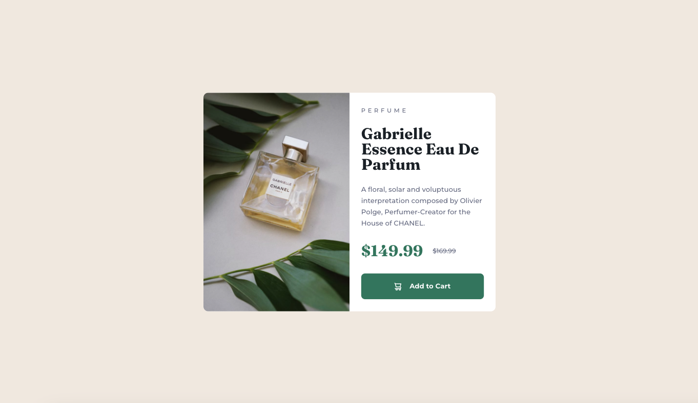

# Frontend Mentor - Product preview card component solution

This is a solution to the [Product preview card component challenge on Frontend Mentor](https://www.frontendmentor.io/challenges/product-preview-card-component-GO7UmttRfa). Frontend Mentor challenges help you improve your coding skills by building realistic projects. 

## Table of contents

- [Overview](#overview)
  - [The challenge](#the-challenge)
  - [Screenshot](#screenshot)
  - [Links](#links)
- [My process](#my-process)
  - [Built with](#built-with)
  - [What I learned](#what-i-learned)
  - [Continued development](#continued-development)
  - [Useful resources](#useful-resources)
- [Author](#author)

## Overview

### The challenge

Users should be able to:

- View the optimal layout depending on their device's screen size
- See hover and focus states for interactive elements

### Screenshot

### Links

- Solution URL: [https://github.com/cjoak1028/product-preview-card](https://github.com/cjoak1028/product-preview-card)
- Live Site URL: [https://product-preview-card-two-mu.vercel.app/](https://product-preview-card-two-mu.vercel.app/)

## My process

### Built with

- Semantic HTML5 markup
- CSS custom properties
- Flexbox
- Mobile-first workflow

### What I learned

Nothing new in particular. I committed myself to this project to get my gears running again.

### Continued development

For this project in particular, I wanted to use vanilla CSS to revisit the fundamentals of CSS. Moving forward, I'll be exploring and utilizing popular tools such as SASS/SCSS and Tailwind.

### Useful resources

- [A Complete Guide to Flexbox](https://css-tricks.com/snippets/css/a-guide-to-flexbox/#aa-flexbox-tricks) - This helped me refresh my memory of Flexbox. Flexbox is my default choice for layout model :).

## Author

- Website - [CJ Kim](https://cjkim.dev/)
- Frontend Mentor - [cjoak1028](https://www.frontendmentor.io/profile/cjoak1028)
- Linkedin - [Link](https://www.linkedin.com/in/david-kim-966351255/)
